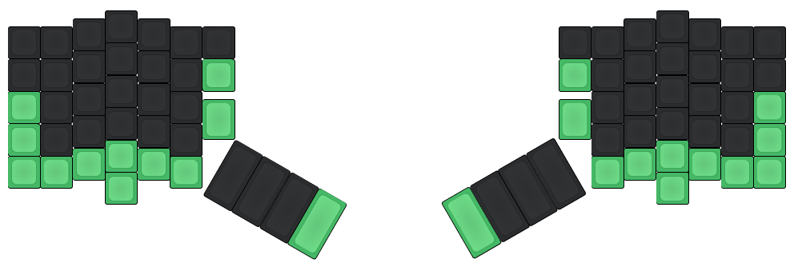

ergomod keyboard firmware
=========================
DIY ergonomic keyboard.

Firmware and documentation based on [gh60](../gh60).

## ergomod resources
- [ergodox](http://ergodox.org/)

## Build
Move to this directory then just run `make` like:

    $ make

## Pinout
I use a Teensy 2.0++ (for future features), here is the pinout.

### Matrix

    LeftPad (8x5):
        col 0       1       2       3       4       5       6       7
    row -------------------------------------------------------------------
      0|  ~         1       2       3       4       5       6       BSpace
      1|  {         Q       W       E       R       T       Fn      Shift
      2|  LCtrl     A       S       D       F       G       Tab     L1
      3|  LShift    Z       X       C       V       B       _NONE_  L0
      4|  LAlt      Insert  Home    PgUp    End     Meta    PgDown  _NONE_

    RightPad(8x5):
      col 8          9       A       B       C       D       E       F
    row -------------------------------------------------------------------
      0|  Space      7       8       9       0       -       +       "
      1|  Return     Esc     Y       U       I       O       P       }
      2|  L2         |       H       J       K       L       ;       RCtrl
      3|  L0         _NONE_  N       M       <       >       ?       RShift
      4|  _NONE_     Down    Meta    Left    Up      Right   Delete  RAlt

### Columns

    col:  0  1  2  3  4  5  6  7  8  9  A  B  C  D  E  F
    pin: F0 F1 F2 F3 F4 F5 F6 F7 C0 C1 C2 C3 C4 C5 C6 C7

### Rows

    row:  0  1  2  3  4
    pin: D0 D1 D2 D3 D4

## Keymap
Several version of keymap are available in advance but you are recommended to define your favorite layout yourself. To define your own keymap create file named `keymap_<name>.c` and see keymap document(you can find in top README.md) and existent keymap files.

To build firmware binary hex file with a certain keymap just do `make` with `KEYMAP` option like:

    $ make KEYMAP=[mod]

### 1  Mod
[keymap_mod.c](keymap_mod.c) contains sources for the following layout.

    Fn + 1 = F1

#### 1.0 Default layer
    ,------------------------------------.          ,------------------------------------.
    | ~    | 1  | 2  | 3  | 4  | 5  | 6  |          |7   | 8  | 9  | 0  | -  | =  |  "   |
    |------------------------------------|          |------------------------------------|
    | {    | Q  | W  | E  | R  | T  | Fn |          |Esc | Y  | U  | I  | O  | P  |  }   |
    |------------------------------------|          |------------------------------------|
    | Ctrl | A  | S  | D  | F  | G  | Tab|          | |  | H  | J  | K  | L  | :  | Ctrl |
    |------------------------------------'          '------------------------------------|
    | Shift| Z  | X  | C  | V  | B  |                    | N  | M  | <  | >  | ?  | Shift|
    |-------------------------------| ,-----.   ,------. |-------------------------------|
    | Alt  | Ins| Hom| PgU| End| Gui| |Bspc |   |Space | |Gui |Left| Up |Righ|Del | AltG |
    `-------------------------------' |-----|   |------| `-------------------------------'
                     | PgD|           |Shift|   |Return|           |Down|
                     `----'           |-----|   |------|           `----'
                                      | L1  |   | L2   |
                                      |-----|   |------|
                                      | L0  |   | L0   |
                                      `-----'   `------'

#### 1.1 Functions layer
    ,------------------------------------.          ,------------------------------------.
    |      | F1 | F2 | F3 | F4 | F5 | F6 |          |F7  | F8 | F9 |F10 | F11| F12|      |
    |------------------------------------|          |------------------------------------|
    |      |    |    |    |    |    |    |          |Powr|Slep|Wake|    |    |Prnt|      |
    |------------------------------------|          |------------------------------------|
    | Ctrl |    |    |    |    |    |    |          |    |    |    |    |Lock|    | Ctrl |
    |------------------------------------'          '------------------------------------|
    | Shift|    |    |    |    |    |                    |    |    |    |    |    | Shift|
    |-------------------------------| ,-----.   ,------. |-------------------------------|
    | Alt  |Prev|Stop|+Vol|Play|    | |Bspc |   |Space | |    |    |    |    |Next| Alt  |
    `-------------------------------' |-----|   |------| `-------------------------------'
                     |-Vol|           |Shift|   |Return|           |    |
                     `----'           |-----|   |------|           `----'
                                      | L1  |   | L2   |
                                      |-----|   |------|
                                      | L0  |   | L0   |
                                      `-----'   `------'

#### 1.2 Mouse layer

    ,------------------------------------.          ,------------------------------------.
    |      |    |    |    |    |    |    |          |    |    |    |    |    |    |      |
    |------------------------------------|          |------------------------------------|
    |      |    |    |    |    |    |    |          |    |    |    |    |    |    |      |
    |------------------------------------|          |------------------------------------|
    |      |    |    |    |    |    |    |          |    |    |    |    |    |    |      |
    |------------------------------------'          '------------------------------------|
    |      |    |    |    |    |    |                    |    |    |    |    |    |      |
    |-------------------------------| ,-----.   ,------. |-------------------------------|
    |      |    |MwL |MwU |MwR |    | |Mb3  |   |Mb1   | |    |McL |McU |McR |    |      |
    `-------------------------------' |-----|   |------| `-------------------------------'
                     |MwD |           |Mb4  |   |Mb2   |           |McD |
                     `----'           |-----|   |------|           `----'
                                      | L1  |   | L2   |
                                      |-----|   |------|
                                      | L0  |   | L0   |
                                      `-----'   `------'
